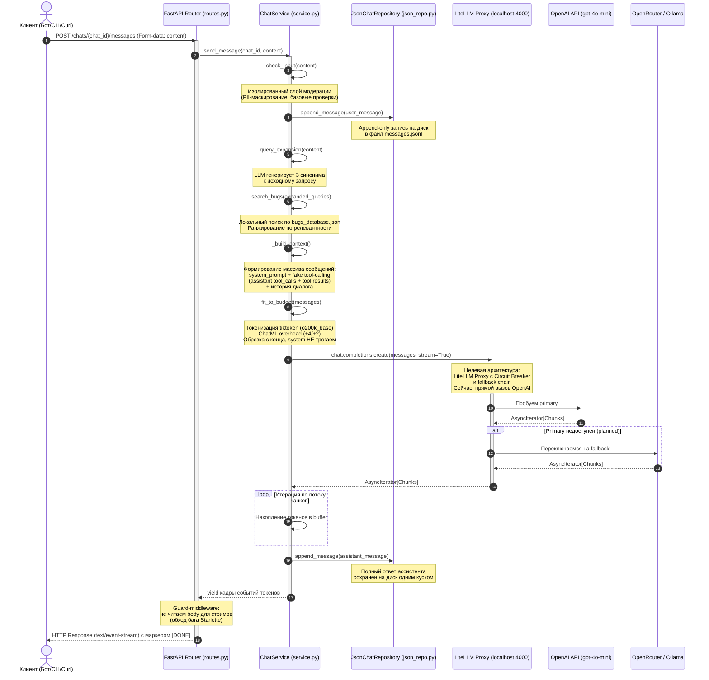

# Документация модуля управления контекстом и историей чатов (app/chat)

## 1. Архитектурная диаграмма последовательности (Mermaid)



**Примечание:** Блок `LiteLLM Proxy` показан как целевая архитектура. В текущей реализации `ChatService` обращается напрямую к OpenAI API. Fallback chain (OpenRouter / Ollama) **не работает**.

---

## 2. Обоснование выбранной стратегии контекста

В проекте реализована стратегия **Token Budget (токеновый бюджет)** через функцию `fit_to_budget`.

### Инженерное обоснование:

1. **Специфика проекта (`bag_assistant`)**: Инструмент автоматического разбора багов и помощи в IT-онбординге оперирует короткими диалоговыми сессиями. Пользователь описывает конкретную техническую ошибку, ассистент задает 2-3 уточняющих вопроса и выдает инструкцию. История глубже 10 шагов теряет актуальность.

2. **MLOps Cost Control (Контроль затрат)**: Токеновый бюджет жестко фиксирует максимальное количество токенов, отправляемых в LLM. Это защищает проект от экспоненциального роста стоимости API-запросов на длинных «зацикленных» диалогах. Системное сообщение никогда не удаляется — оно содержит критические инструкции по классификации багов.

3. **Оптимизация Time-to-First-Token (TTFT)**: Чтение ограниченного количества строк из append-only хранилища `messages.jsonl` без полного разбора всего файла (цикла parse-rewrite-write) выполняется за константное время O(1), что минимизирует задержку генерации ответа.

### Токенизация:

- Кодировка: `tiktoken`, `o200k_base` (соответствует `gpt-4o-mini`)
- ChatML overhead:
  - Системное сообщение: +4 токена
  - Обычное сообщение: +2 токена
- Обрезка: с конца истории, пока сумма не уложится в бюджет. System **не трогается**.

---

## 3. Поток обработки запроса

При получении сообщения сервис проходит следующие этапы:

1. **Query Expansion** — LLM (`gpt-4o-mini`) генерирует 3 синонима к запросу пользователя.
2. **Локальный поиск** — расширенные запросы ищутся в `bugs_database.json`. Найденные баги ранжируются.
3. **Fake Tool-Calling** — результаты поиска вставляются в контекст как имитация вызова инструмента (`assistant` с `tool_calls` + `tool` с результатами).
4. **Классификация** — LLM получает системный промпт со шкалой релевантности:
   - **3–5 баллов** — релевантные баги
   - **2 балла** — менее релевантные
5. **Streaming** — ответ возвращается через SSE чанками.

### Целевой поток (через LiteLLM Proxy):

В целевой архитектуре шаг 4 проходит через **LiteLLM Proxy** (localhost:4000):
- Прокси проверяет доступность primary (OpenAI GPT-4o-mini).
- При отказе (429, 503, 403) автоматически переключается на secondary (OpenRouter GPT-OSS Free Tier).
- При полном отсутствии сети — на tertiary (Ollama Qwen 2.5 локально).
- Circuit Breaker отслеживает ошибки и «размыкает цепь» после 3 падений.

**Сейчас:** LiteLLM Proxy **не поднят**. `ChatService` вызывает OpenAI API напрямую. Fallback chain **не работает**.

---

## 4. Практические примеры Curl-запросов

### 4.1. Создание нового чата

```bash
curl -X POST http://localhost:8000/chats \
  -H "Content-Type: application/json" \
  -d '{"owner_external_id":"test-1","interface":"cli"}'
```

*Ожидаемый ответ:* `{"chat_id": "8f7a5406-bb79-45e7-88eb-06bd77130afe"}`

### 4.2. Отправка сообщения (SSE Streaming)

Передача контента реализована через `multipart/form-data` для предотвращения конфликтов с асинхронными middleware Starlette.

```bash
curl -N -X POST http://localhost:8000/chats/8f7a5406-bb79-45e7-88eb-06bd77130afe/messages \
  -F "content=Привет, меня зовут Аня"
```

*Ожидаемый потоковый ответ:*
```text
data: {"type": "token", "delta": "Привет"}
data: {"type": "token", "delta": "!"}
data: {"type": "message_saved", "message_id": "1f3843c3-..."}
data: [DONE]
```

### 4.3. Получение хронологической истории сообщений чата

```bash
curl -X GET "http://localhost:8000/chats/8f7a5406-bb79-45e7-88eb-06bd77130afe/messages?limit=50"
```

*Ожидаемый ответ:* Хронологический массив объектов `[user, assistant, user, assistant, ...]`

### 4.4. Мягкая очистка истории диалога (Soft Delete)

```bash
curl -X DELETE http://localhost:8000/chats/8f7a5406-bb79-45e7-88eb-06bd77130afe/messages
```

*Ожидаемый ответ:* `{"status":"ok"}`. При последующем вызове `GET /messages` вернется пустой список `[]`.

---

## 5. Стриминг и обход бага Starlette

SSE-стриминг реализован через `StreamingResponse`. Известный баг Starlette: `BaseHTTPMiddleware` пытается прочитать тело запроса (`await request.body()`), что ломает стриминг.

**Решение:** Guard-middleware проверяет заголовок `Content-Type` запроса. Для стрим-запросов middleware **не читает** тело запроса, пропуская его дальше без буферизации.

**Статус:** Реализовано. Guard работает стабильно.

---

## 6. LiteLLM Proxy: целевая интеграция

### Зачем нужен LiteLLM

Вместо прямого вызова OpenAI API планируется единая точка входа — **LiteLLM Proxy** (localhost:4000). Это даёт:
- **Circuit Breaker** — автоматическое переключение при отказе провайдера.
- **Fallback chain** — OpenAI → OpenRouter → Ollama.
- **Единый интерфейс** — `ChatService` не знает, какая модель отвечает.

### Как будет выглядеть вызов (целевой)

```python
# Сейчас (прямой вызов):
response = await openai_client.chat.completions.create(
    model="gpt-4o-mini",
    messages=messages,
    stream=True
)

# Целевой (через LiteLLM):
response = await litellm_client.chat.completions.create(
    model="gpt-4o-mini",  # LiteLLM сам маршрутизирует
    messages=messages,
    stream=True
)
```

### Конфигурация прокси

Файл `docs/litellm/config.yaml` уже подготовлен. Содержит 3 провайдера с `routing_strategy: failover`.

**Статус:** LiteLLM Proxy **не поднят**. Интеграция с `ChatService` **не выполнена**.

---

## 7. Текущее состояние и техдолг

| Элемент | Статус | Примечание |
|---------|--------|------------|
| `/chats` (stateful) | Реализовано | CRUD + SSE-стриминг |
| `/chat` (stateless) | Дублирует логику | В процессе удаления |
| `JsonChatRepository` | Реализовано | Append-only JSONL |
| `PostgresChatRepository` | Готов, не подключён | SQLAlchemy 2.x async |
| Query Expansion | Реализовано | 3 синонима через `gpt-4o-mini` |
| Локальный поиск багов | Реализовано | `bugs_database.json` |
| Fake Tool-Calling | Реализовано | Assistant + tool сообщения |
| `fit_to_budget` | Реализовано | Токенизация + обрезка |
| SSE Streaming + Guard | Реализовано | Обход бага Starlette |
| LiteLLM Proxy | **Не реализовано** | Конфиг готов, интеграция не сделана |
| Circuit Breaker | **Не реализовано** | Будет через LiteLLM |
| Fallback chain (OpenRouter/Ollama) | **Не реализовано** | Нет ключей, нет инфраструктуры |
| Захардкоженная дата в system prompt | Техдолг | `2026-06-02`, нужно динамическое значение |
